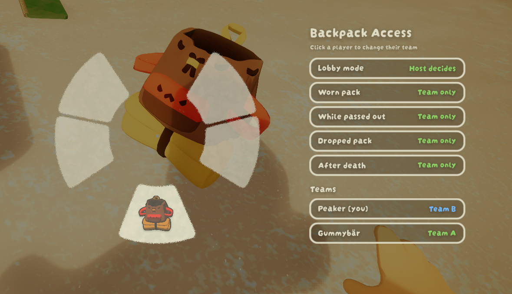
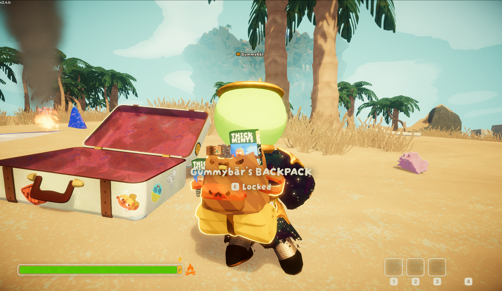

# BackpackPermission

A BepInEx mod for **PEAK**. You decide who may open the backpack, fannypack, jetpack or
rocketpack on your back. **Default: nobody.** Other players can neither take items out nor
put items in, and they cannot light your rocketpack.



## How it works

1. Drop your backpack and open it as usual.
2. A **Backpack Access** panel appears next to the wheel, styled like the hotbar, listing
   every player in the lobby.
3. Keep the interact key held and **click** a row. It toggles between *Allowed* and *Locked*
   right away, so you can set up the whole lobby in one go.
4. Release the key and put the backpack back on. Done.

Extra rows in the panel:

Four rows decide who may access your pack in which situation, each either **My list** or
**Everyone**:

| Row | Meaning | Default |
|---|---|---|
| Worn pack | The pack on your back. | My list |
| While passed out | Your pack while you lie passed out, so friends can help you. | Everyone |
| Dropped pack | The pack after you put it down. | My list |
| After death | The pack you dropped when you died. | Everyone |

Locked players see **Locked** instead of *Open* when looking at your back and get no hold
bar. Permissions are remembered by Steam ID and apply again in your next session.



## Host mode

The host can take over: open your own pack as host and switch **Lobby mode** to *Host decides*.

- Click a player row to move them through **Team A, B, C, D** and back to *No team*.
- Team mates may access each other's packs. Players without a team are locked for everyone.
- The same four rows as in individual mode, *Worn pack*, *While passed out*, *Dropped pack* and
  *After death*, now decide between **Team only** and **Everyone** for the whole lobby.
  Defaults: worn and dropped packs team only, passed out and death drops open.
- While host mode is active, the individual lists of all players are ignored. Everyone else
  sees a read-only overview of the teams. Switch back to *Individual* and the personal lists
  apply again.
- Team assignments are remembered by Steam ID. The rule expires automatically if the host who
  set it leaves the lobby.

Host mode protects every player in the lobby, including those without the mod, because the
host evaluates every pickup.

## Multiplayer

Your rule is published as a Photon player property. Every client, including late joiners,
knows it immediately. No custom RPCs, no extra network traffic.

| Who has the mod | Result |
|---|---|
| Only you, and you are the host | Taking and stashing are blocked: as host you deny pickups and bounce stashed items back to the ground next to the stasher. Lighting a rocketpack by players without the mod cannot be blocked. |
| Only you, someone else hosts | No protection. Nobody evaluates your rule. |
| You and the host | Taking and stashing are blocked by the host. Lighting a rocketpack by players without the mod cannot be blocked. |
| Everyone | Full protection: no taking, no stashing, no lighting. |

Players without the mod behave like vanilla towards you: their packs stay open. The host keeps
track of who dropped which pack and why, so the *Dropped pack* and *After death* rules also
work for players without the mod as long as the host has it. Packs that nobody wore, for
example straight out of a luggage, are open to everyone.

## Installation

Install with [r2modman](https://thunderstore.io/c/peak/p/ebkr/r2modman/) or the Thunderstore
app, or manually: copy `BackpackPermission.dll` into `BepInEx/plugins/`. Requires
[BepInExPack PEAK](https://thunderstore.io/c/peak/p/BepInEx/BepInExPack_PEAK/).

## Configuration

`BepInEx/config/com.peakcode.backpackpermission.cfg`

| Section | Key | Default | Meaning |
|---|---|---|---|
| General | UnlockWhilePassedOut | true | Everyone may access your pack while you are passed out. |
| General | ProtectDroppedPack | true | Your list keeps applying to a pack you put down. |
| General | ProtectPackAfterDeath | false | Your list keeps applying to a pack you dropped on death. |
| General | RememberAllowedPlayers | true | Remember allowed players by Steam ID across sessions. |
| General | Language | English | English, Deutsch, or Auto (follows the game language). |
| UI | PanelOffsetX | 340 | Distance of the panel from the wheel center. |
| UI | PanelWidth | 380 | Panel width. |
| UI | PanelScale | 1.0 | Panel scale. |
| Saved | AllowedPlayers | empty | Managed by the mod. |
| Saved | AllowEveryone | false | Managed by the mod. |
| Host | LobbyMode | Individual | Applies when you host: Individual or HostControlled. Toggle in the wheel. |
| Host | Teams | empty | Managed by the mod: team assignments by Steam ID. |
| Host | UnlockWhilePassedOut | true | Host mode: everyone may access a passed out player's pack. |
| Host | AllowEveryone | false | Host mode: everyone may access every pack. |
| Host | DroppedPacksTeamOnly | true | Host mode: packs put down stay restricted to the owner's team. |
| Host | DeathDropsTeamOnly | false | Host mode: packs dropped on death stay restricted to the owner's team. |
| Debug | Verbose | false | Verbose logging including a UI hierarchy dump. |

## Known limitations

- The panel is mouse only. Gamepad wheel navigation does not reach the rows.

## Building

The repository does not contain game assemblies. Create `libs/` next to `src/` and copy these
DLLs from `PEAK/PEAK_Data/Managed/` and `PEAK/BepInEx/core/`:

```
0Harmony.dll  BepInEx.dll  Photon3Unity3D.dll  PhotonRealtime.dll  PhotonUnityNetworking.dll
Unity.TextMeshPro.dll  Unity.InputSystem.dll  UnityEngine.dll  UnityEngine.CoreModule.dll
UnityEngine.UI.dll  UnityEngine.UIModule.dll  UnityEngine.TextRenderingModule.dll
UnityEngine.PhysicsModule.dll  UnityEngine.AnimationModule.dll  Zorro.Core.Runtime.dll
Zorro.UI.Runtime.dll  Zorro.ControllerSupport.dll
```

Publicize `Assembly-CSharp.dll` (for example with
[BepInEx.AssemblyPublicizer](https://github.com/BepInEx/BepInEx.AssemblyPublicizer)) and save
it as `libs/Assembly-CSharp-publicized.dll`. Then:

```bash
dotnet build src/BackpackPermission.csproj -c Release
```

`./deploy.sh` builds and copies the DLL into the game's plugin folder. `./release.sh` builds
the Thunderstore zip into `release/`.

## License

GPL-3.0. See [LICENSE](LICENSE).
